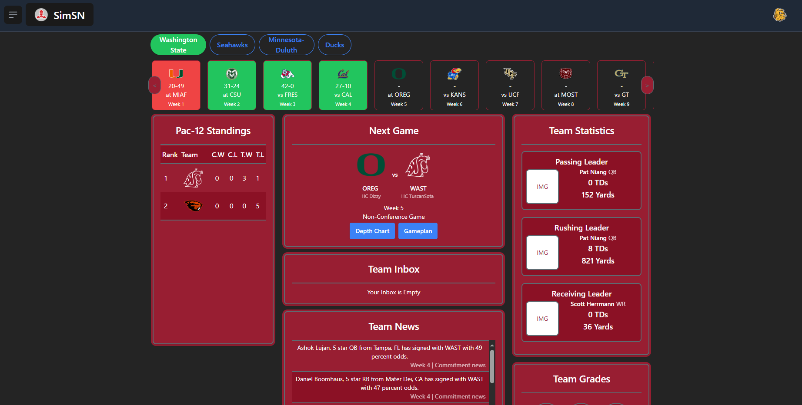
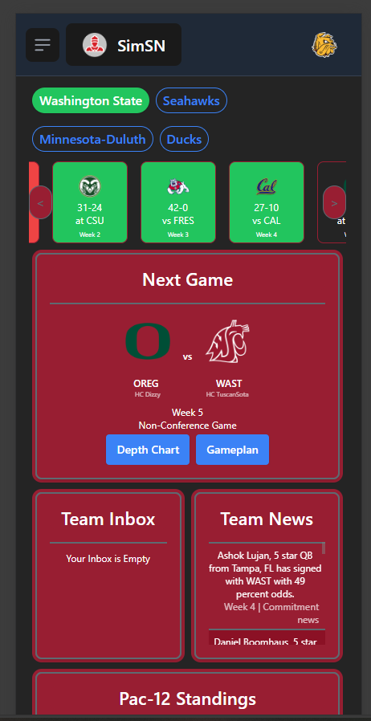
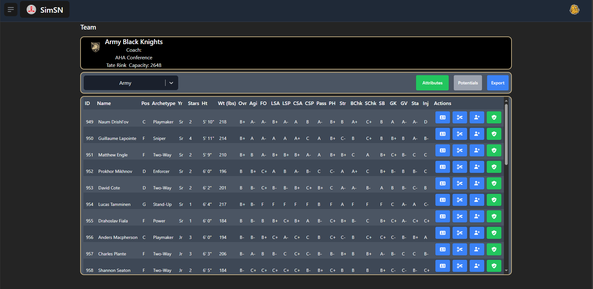
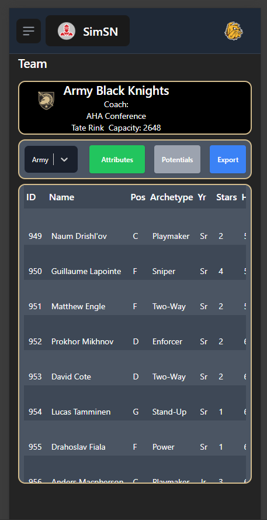
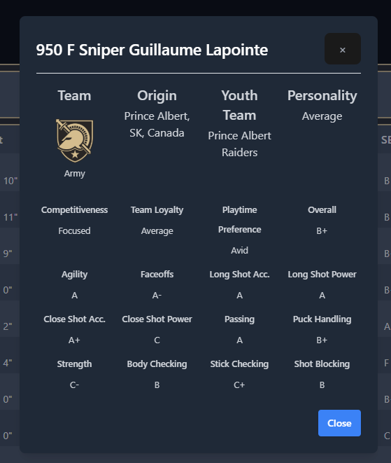

# 🏈 SimSN Interface 2.0

**SimSN Interface 2.0** is a modern, responsive frontend for managing online simulation leagues run by the [Simulation Sports Network (SimSN)](https://www.simulationsports.net).  
This app serves as the hub for SimSN’s **College Football, Pro Football, College Basketball, Pro Basketball**, and our upcoming **College & Pro Hockey** leagues.

This project is a complete overhaul of our original web application, redesigned with **user experience**, **developer onboarding**, and **scalability** in mind. The development of this project is for educational purposes for bettering our software engineering skills and providing a community solution for a passion project. This project is absolutely free and will remain free at no cost.

---

## 🛠 Tech Stack

This frontend project is built using:

- [**React.js**](https://react.dev/)
- [**TypeScript**](https://www.typescriptlang.org/)
- [**Firebase**](https://firebase.google.com/)
- [**Tailwind CSS**](https://tailwindcss.com/)
- [**Vite**](https://vite.dev/)
- [**React-Select**](https://react-select.com/home)
- [**Heroicons**](https://heroicons.com/)
- [**Notistack**](https://notistack.com/)
- **Faces.js** (Credit to [ZenGM](https://github.com/zen-development/zen-gm))

---

## 🎨 Design System

We are using **Tailwind CSS** to power our custom UI component library, purpose-built for this project. The component library is designed for reusability, accessibility, and fast iteration.

---

## 🖼 Screenshots

> A preview of SimSN Interface 2.0, showing different modules across college football and hockey simulation leagues.

### 🔘 Team Selection Interface

Browse available teams across multiple conferences with live detail previews.


### 📅 Landing Page

Users will be able to view relevant team information upon login with their team. The landing page features a game bar with the team's scheduled games for the season, information for their next game, their top players by stats, team grades, and news related to their team.



### 📱 Responsive Mobile View

The interface web application is being built with responsiveness in mind - all of our components will be viewable in desktop, mobile, and tablet views!



### 🏒 Hockey Roster Management

Our hockey users will be able to view their roster in both desktop & mobile form. If a user wants to view more information on the player, they can view the player detail modal (shown in next section). Users are also able to export their roster into a CSV format.



### 👤 Player Detail Modal



---

## 🚀 Getting Started

> _Note: This project is not yet publicly deployed. A test account or live demo is not currently available._

### Local Development

```bash
git clone https://github.com/your-username/simsn-interface.git
cd simsn-interface
npm install
npm run dev
```

## 🤝 Collaboration

This project is being built collaboratively by a small team of frontend engineers. One of our goals is to use this project as a way to **mentor and grow together** by focusing on:

- Clean component architecture
- Scalable state management
- Reusable design systems
- Real-world application patterns

Interested in contributing or reviewing the code? Feel free to reach out via GitHub or open an issue!

---

## 🙏 Acknowledgments

We’d like to credit the open-source libraries and tools that make this project possible. Special thanks to:

- [ZenGM / Faces.js](https://github.com/zen-development/zen-gm) for player avatar generation
- The creators and maintainers of the open-source libraries used throughout this project
- The SimSN community for testing, feedback, and support

---

## ⚠️ Legal Disclaimer

This application uses publicly available team logos from the **NCAA, NFL, NBA, and NHL** for illustrative purposes only.  
We are **not affiliated with or endorsed by** these organizations. No revenue is generated from this project—**it is completely free and intended for community use only.**

All logos are the property of their respective owners. If you're a representative of any organization and would like us to remove a specific logo, please open an issue or contact us directly.
